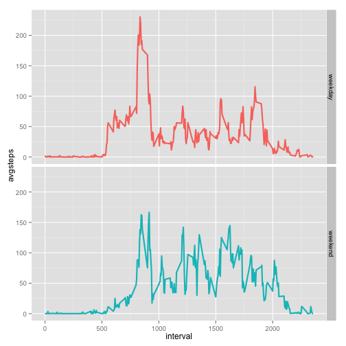

#Peer Assessment 1


By Ning Ning

This assignment makes use of data from a personal activity monitoring device, which collects data at 5 minute intervals through out the day. The data consists of two months of data from an anonymous individual collected during the months of October and November, 2012 and include the number of steps taken in 5 minute intervals each day.

###Loading and preprocessing the data

1.Load the data:


```r
setwd("~/r/RER")
url<-"https://d396qusza40orc.cloudfront.net/repdata%2Fdata%2Factivity.zip"
download.file(url,destfile="repdata-data-activity.zip",method="curl")
unzip("repdata-data-activity.zip")
data<-read.csv("activity.csv")
```

2.Process/transform the data (if necessary) into a format suitable for your analysis:


```r
summary(data)
```

```
##      steps                date          interval     
##  Min.   :  0.00   2012-10-01:  288   Min.   :   0.0  
##  1st Qu.:  0.00   2012-10-02:  288   1st Qu.: 588.8  
##  Median :  0.00   2012-10-03:  288   Median :1177.5  
##  Mean   : 37.38   2012-10-04:  288   Mean   :1177.5  
##  3rd Qu.: 12.00   2012-10-05:  288   3rd Qu.:1766.2  
##  Max.   :806.00   2012-10-06:  288   Max.   :2355.0  
##  NA's   :2304     (Other)   :15840
```

Remove the missing value and creat a new data set.


```r
rnadata<-data[complete.cases(data),]
```

###Calculate mean total number of steps taken per day

1.Calculate the total number of steps taken per day


```r
TS<-aggregate(rnadata$steps,by=list(rnadata$date),FUN=sum)
names(TS)<-c("date","Totalsteps")
```

2.Make a histogram of the total number steps per day


```r
library(ggplot2)
ggplot(TS,aes(x=Totalsteps))+ geom_histogram(binwidth=500,colour="black", fill="white")+labs(x="Total steps")
```

 

3.Calculate and report the mean and median of the total number of steps taken per day


```r
mean(TS$Totalsteps)
```

```
## [1] 10766.19
```

```r
median(TS$Totalsteps)
```

```
## [1] 10765
```

###Caculate the average daily activity pattern

1.Make a time series plot (i.e. type = "l") of the 5-minute interval (x-axis) and the average number of steps taken, averaged across all days (y-axis)


```r
ada<-aggregate(rnadata$steps,by=list(rnadata$interval),FUN=mean)
names(ada)<-c("interval","avgsteps")
g<-ggplot(ada,aes(interval,avgsteps))
g+geom_line(size=1)
```

 

2.Find which 5-minute interval, on average across all the days in the dataset, contains the maximum number of steps


```r
ada$interval[which.max(ada$avgsteps)]
```

```
## [1] 835
```

###Imputing missing values

1.Calculate and report the total number of missing values in the dataset


```r
nadata<-data[!complete.cases(data),]
nrow(nadata)
```

```
## [1] 2304
```

2.Devise a strategy for filling in all of the missing values in the dataset.

I plan to fill in all of the missing values in the dataset by the mean for that 5-minute interval aross all the days

3.Create a new dataset that is equal to the original dataset but with the missing data filled in.


```r
ndata<-data
ndata$steps[is.na(ndata$steps)]=ada$avgsteps
summary(ndata)
```

```
##      steps                date          interval     
##  Min.   :  0.00   2012-10-01:  288   Min.   :   0.0  
##  1st Qu.:  0.00   2012-10-02:  288   1st Qu.: 588.8  
##  Median :  0.00   2012-10-03:  288   Median :1177.5  
##  Mean   : 37.38   2012-10-04:  288   Mean   :1177.5  
##  3rd Qu.: 27.00   2012-10-05:  288   3rd Qu.:1766.2  
##  Max.   :806.00   2012-10-06:  288   Max.   :2355.0  
##                   (Other)   :15840
```

4.Make a histogram of the total number of steps taken each day. Calculate and report the mean and median total number of steps taken per day.


```r
nTS<-aggregate(ndata$steps,by=list(ndata$date),FUN=sum)
names(nTS)<-c("date","Totalsteps")
ggplot(nTS,aes(x=Totalsteps))+ geom_histogram(binwidth=500,colour="black", fill="white")+labs(x="Total steps")
```

 


```r
mean(nTS$Totalsteps)
```

```
## [1] 10766.19
```

```r
median(nTS$Totalsteps)
```

```
## [1] 10766.19
```

Compare these values with the estimates from the first part of the assignment (where mean=10766.19,median=10765). We can see that after imputing the missing value, there is no difference in the estimation of the mean, but slight diference in that of the median. 

###Activity patterns between weekdays and weekends

1. Create a new factor variable in the dataset with two levels – “weekday” and “weekend” indicating whether a given date is a weekday or weekend day.


```r
ndata$days<-ifelse(weekdays(as.Date(ndata$date),abbreviate = FALSE)=="Sunday"|weekdays(as.Date(ndata$date),abbreviate = FALSE)=="Saturday","weekend","weekday")
summary(ndata)
```

```
##      steps                date          interval          days          
##  Min.   :  0.00   2012-10-01:  288   Min.   :   0.0   Length:17568      
##  1st Qu.:  0.00   2012-10-02:  288   1st Qu.: 588.8   Class :character  
##  Median :  0.00   2012-10-03:  288   Median :1177.5   Mode  :character  
##  Mean   : 37.38   2012-10-04:  288   Mean   :1177.5                     
##  3rd Qu.: 27.00   2012-10-05:  288   3rd Qu.:1766.2                     
##  Max.   :806.00   2012-10-06:  288   Max.   :2355.0                     
##                   (Other)   :15840
```

2.Make a panel plot containing a time series plot of the 5-minute interval (x-axis) and the average number of steps taken, averaged across all weekday days or weekend days (y-axis).


```r
nada<-aggregate(ndata$steps,by=list(ndata$interval,ndata$days),FUN=mean)
names(nada)<-c("interval","days","avgsteps")
ggplot(nada,aes(interval,avgsteps,colour=days))+geom_line(size=1)+facet_grid(days~.)+theme(legend.position="none")
```

 
